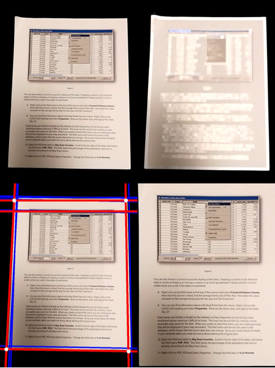
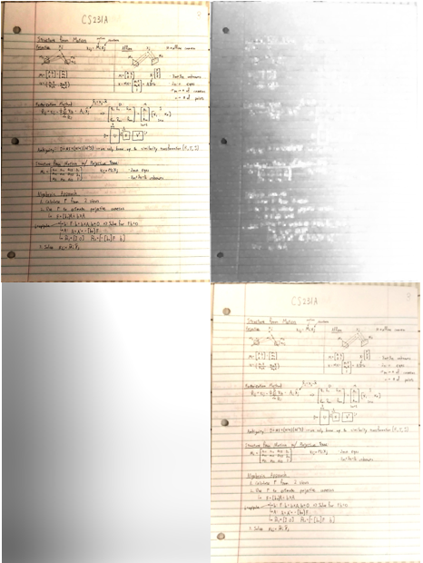
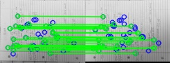
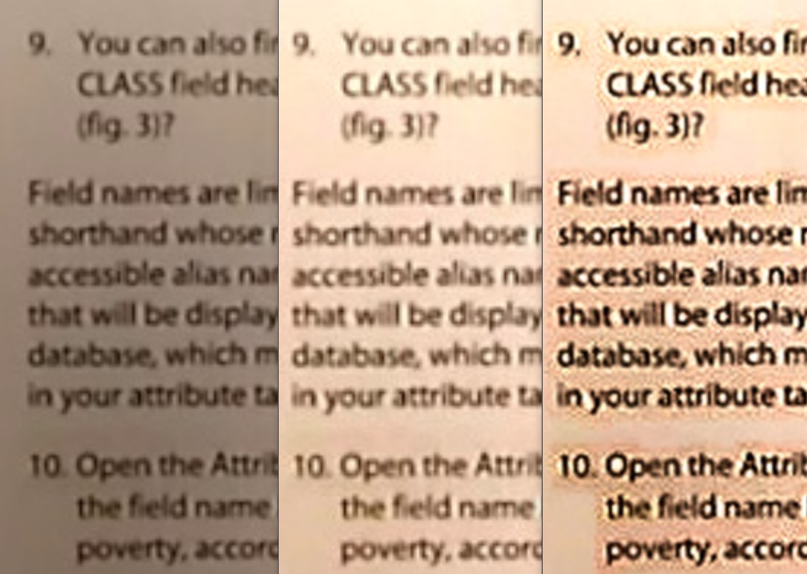
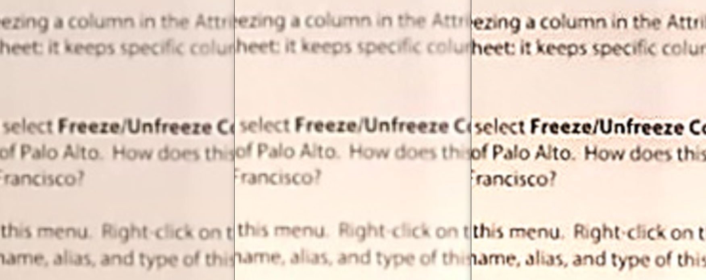
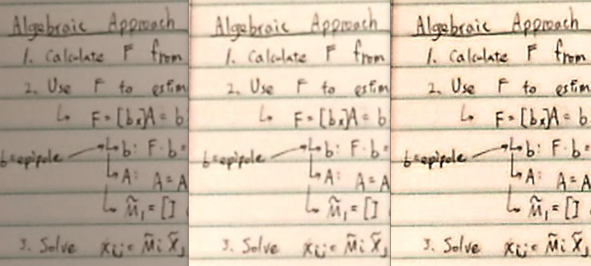

# Video2PDF
We introduce a system which takes a video of a document to be scanned as its input and outputs a set of images that correspond to the document pages. These images could then be converted to a single pdf file. Unlike the earlier works, not only does the system recognize each page flips and rectifies the pages, it also applies a series of image enhancements to improve the output image quality. The system also contains a false positive mechanism to remove any duplicate images. As taking a video takes significantly less time than scanning each page at a time using traditional methodologies, this greatly reduces the amount of time and mental pain that a user must go through when scanning documents.

## boundingbox.py
Takes in a segmented image as an input. 
Figures out the bounding box and rectifies the image. 

## brightnessAdjust.py
Takes in a rectified image as an input.  
Guesses the brightness information of the input image, and tries to remove the uneven brightness distribution. 

## finalScript.py
Automates the process of bounding box identification, image rectification, brightness identification, and Super Resolution.

## hand_detection.py
Takes in a segmented image as an input.  
Identifies frames with hands in them, and removes those frames.

## segmentation2.py
Uses estimateRigidTransform() to segment a video. If the affine transform of consecutive frames is "large," two frames are deemed to be of different pages.

## SR.py
Takes the brightness adjusted image as the input.  
Applies edge enhancement to the image.

## surf_matching.py
Uses SURF feature points to segment a video. If consecutive frames contain a few matching features, two frames are deemed to be of different pages. 

## Results
Results are shown in following images. From the left, the images are: original, brightness adjusted, and super resolutioned.  
  
  
